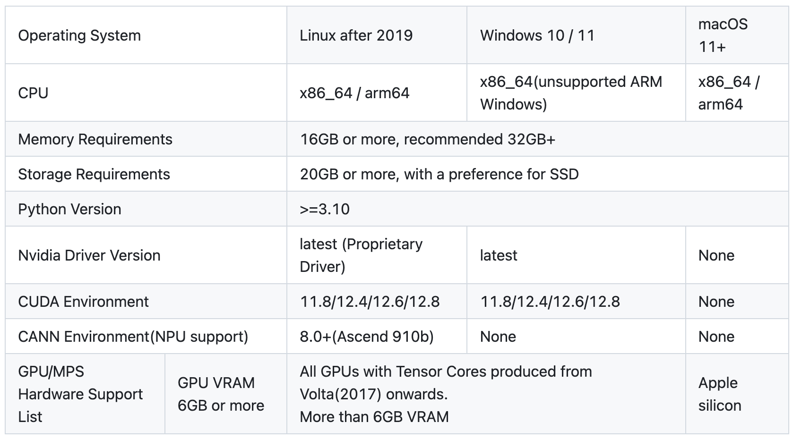
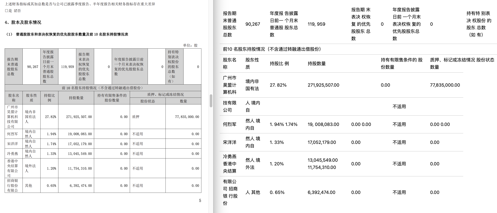
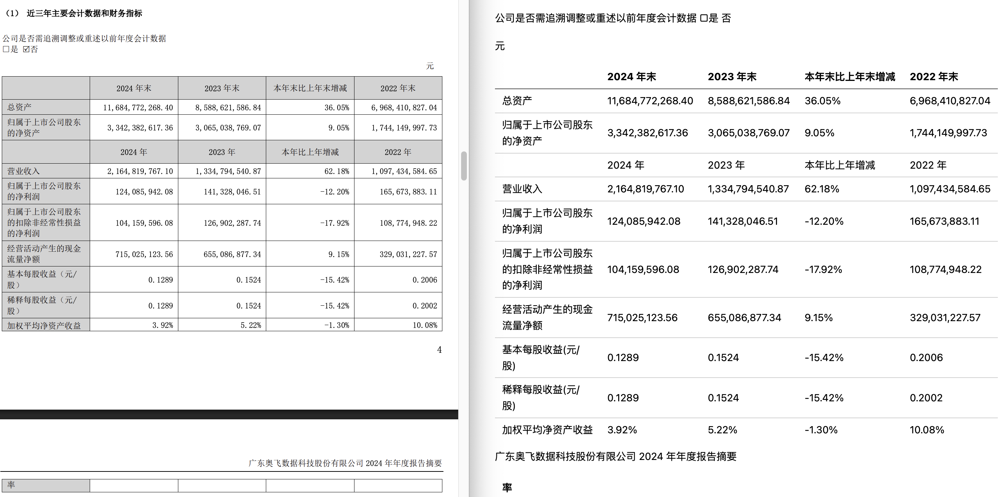
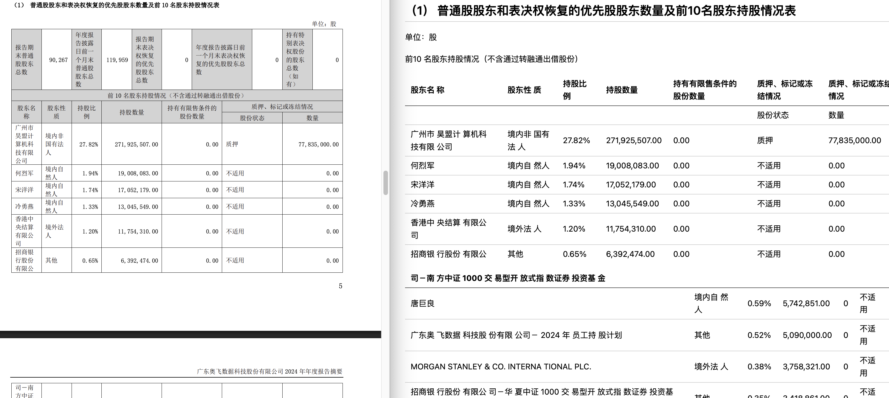
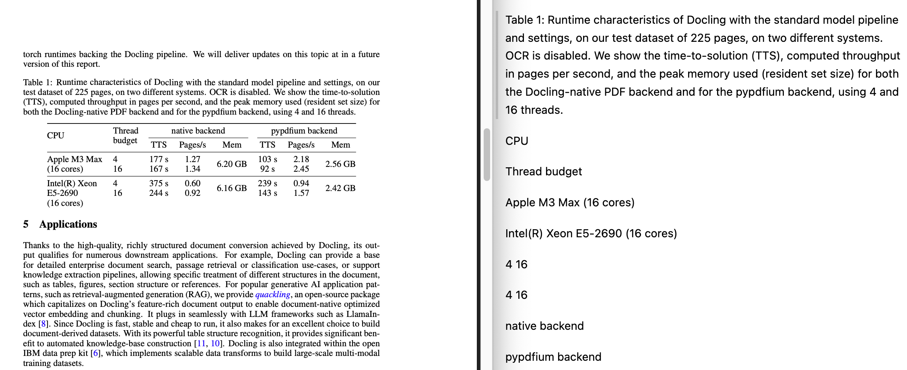
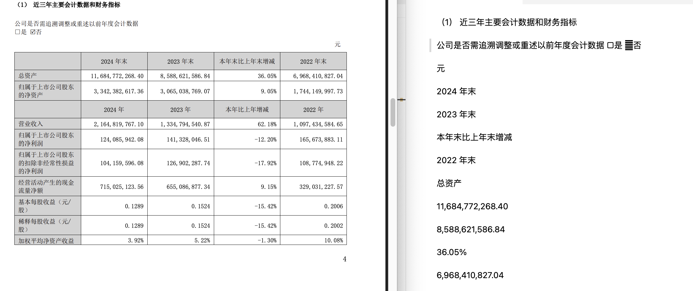

# Open-Source Document Parsing Tools Evaluation

This report presents a comprehensive comparison and analysis of current mainstream open-source document parsing tools (including Marker, MinerU, Docling, olmOCR, etc.), systematically surveying their practical performance in areas such as structure recognition, OCR processing, document format support, resource consumption, processing speed, local/cloud deployment, API integration capabilities, and license friendliness.

Each of these document parsing tools has its unique features and is suited for different application scenarios. This report aims to assist you in making the best tool selection decision based on your specific needs.

## 1 Introduction to Open-Source Document Parsing Tools

### 1.1 MinerU

[MinerU](https://github.com/opendatalab/MinerU) is an open-source document extraction tool developed by OpenDataLab, focusing on high-quality conversion of PDFs into machine-readable structured data. It has the following features:

- In terms of document parsing, MinerU can automatically remove distracting elements such as headers, footers, footnotes, and page numbers to ensure semantic coherence in the extracted text. It outputs text that follows a human reading order and adapts to single-column, multi-column, and complex layouts. MinerU also fully preserves structural information such as headings, paragraphs, and lists, and supports the extraction of images, image captions, tables, table titles, and footnotes. The built-in formula recognition function can automatically convert formulas in documents to LaTeX format, while tables can be converted to HTML format. Additionally, MinerU can detect scanned PDFs or corrupted PDFs and enable OCR functionality, supporting the detection and recognition of 84 languages. For output, MinerU supports multiple formats, including Markdown for multimodal and NLP tasks, JSON sorted by reading order, and intermediate formats containing rich document information. It also provides layout visualization and span visualization features for efficient quality inspection and output verification.
    
    However, MinerU has some known limitations in document processing. For instance, reading order is inferred by the model based on the spatial distribution of readable content, and in extremely complex layouts, some regions might experience order disruptions. Vertical text is currently not supported. Table of contents and list recognition are rule-based, so some unconventional list formats may not be recognized accurately. MinerU currently only supports single-level headings and does not yet support hierarchical heading parsing. Also, layout models do not currently support recognizing code blocks. For comic books, art albums, primary school textbooks, and workbooks, parsing results are limited. In table processing, complex tables may have row/column recognition errors. Although OCR supports 84 languages, inaccuracies may occur when dealing with PDFs in lesser-known languages (such as additional diacritics in Latin scripts or easily confused characters in Arabic scripts). Some formulas may not render perfectly in Markdown output.
    
- In terms of deployment, MinerU supports operation in a pure CPU environment, as well as GPU (CUDA), NPU (CANN), and MPS acceleration, adapting to Windows, Linux, and Mac platforms. Specific configuration requirements are as follows:
    
    
    
    MinerU can be deployed locally via a Conda environment or Docker image. Additionally, MinerU offers a very convenient [client](https://mineru.net/client?source=github) and supports online demos on HuggingFace, ModelScope, and its official website.
    
- Regarding API integration, users can easily use MinerU via command-line tools or a Python SDK.
- Regarding the license, MinerU currently depends on PyMuPDF (AGPL-3.0 license), which may impose restrictions in certain commercial use cases; the team has planned to replace or supplement the PDF processing library with a more permissive licensed one in future versions to enhance flexibility for enterprise and individual users.

### 1.2 Marker

[Marker](https://github.com/VikParuchuri/marker) is used to quickly and accurately convert PDF files into Markdown, JSON, and HTML formats, with the following features:

- In terms of document parsing, Marker can rapidly and accurately convert PDFs, images, PPTX, DOCX, XLSX, HTML, EPUB files across multiple languages into Markdown, JSON, or HTML. It supports formatting of tables, forms, formulas, inline math, links, references, code blocks, image extraction, and header/footer removal. It can also be extended with custom logic or combined with large language models (LLMs) to further boost accuracy. Marker is built on the open-source [Surya](https://github.com/VikParuchuri/surya) engine, a document OCR toolkit that supports over 90 languages and provides text detection, layout analysis, reading order, and table recognition.
- For deployment, Marker supports operation on GPU, CPU, or MPS.
- Regarding API integration, Marker provides an easy-to-use command-line tool and Python SDK. For small-scale usage, Marker offers a simple FastAPI-based API server; for larger commercial use cases, a hosted [Datalab API](https://www.datalab.to/plans) is available.
- For the license, Marker uses the GPL-3.0 license. Model weights are under CC-BY-NC-SA-4.0 by default, but any organization with total revenue under $5 million and cumulative venture/angel funding under $5 million over the past 12 months may be exempted from non-commercial restrictions (provided they do not compete with the Datalab API).

### 1.3 Docling

[Docling](https://github.com/docling-project/docling) simplifies document processing tasks, capable of parsing various formats with advanced PDF understanding capabilities, and can be seamlessly integrated into generative AI ecosystems. It has the following features:

- In document parsing, Docling supports PDF, DOCX, XLSX, HTML, image files, and more, with advanced PDF understanding features like page layout, reading order, table structures, code, formulas, image classification, and adopts a unified and user-friendly `DoclingDocument` representation format. It offers multiple export options, including Markdown, HTML, and lossless JSON, supports local execution to protect sensitive data, and is suitable for isolated network environments. Docling includes OCR capabilities to handle scanned PDFs and image files. Furthermore, support for vision-language models (SmolDocling) has been added.
- For deployment, Docling supports macOS, Linux, and Windows environments.
- Regarding API integration, Docling supports command-line tools and a Python SDK. It can also directly integrate into agent frameworks such as LangChain, LlamaIndex, Crew AI, and Haystack.
- In terms of licensing, the Docling codebase follows the MIT License.

### 1.4 MarkItDown

[MarkItDown](https://github.com/microsoft/markitdown) is a lightweight Python tool developed by Microsoft, designed to convert various types of files into Markdown for seamless integration with large language models (LLMs) and text analysis pipelines. It offers the following features:

- For document parsing, MarkItDown supports parsing PDF, PPT, Word, Excel, images, audio, HTML, CSV, JSON, XML, ZIP files, YouTube links, EPUB, and more. Likewise, MarkItDown focuses on preserving important document structures and content such as headings, lists, tables, and links, providing output that is generally user-friendly and easy to read.
- Regarding API integration, MarkItDown supports command-line tools and a Python SDK. Moreover, the latest version introduces the MCP server (markitdown-mcp).
- For the license, MarkItDown's codebase is under the MIT License. It should be noted that the MarkItDown project may include trademarks or logos for projects, products, or services. Authorized use of Microsoft trademarks or logos must comply with Microsoft's Trademark & Brand Guidelines. Any use of third-party trademarks or logos must comply with the respective third party's policies.

### 1.5 olmOCR

[olmOCR](https://github.com/allenai/olmocr) is a toolkit developed by the AllenNLP team for training language models to work with PDF documents.

- In document parsing, olmOCR provides high-quality text parsing based on ChatGPT-4o, language filtering and SEO spam removal, fine-tuning support for Qwen2-VL and Molmo-O, large-scale PDF batch processing, and Dolma format document viewing functionality.
- Regarding deployment, using olmOCR requires a recent NVIDIA GPU with at least 20GB of memory (such as RTX 4090, L40S, A100, H100) and 30GB of disk space.
- Regarding licensing, olmOCR is licensed under the Apache 2.0 License.


### 1.6 Summary

The following table provides a brief summary of the supported formats and licenses of the above document parsing tools:

| Tool Name      | Supported Formats                                                                                      | License                                                                                                                           |
| -------------- | ------------------------------------------------------------------------------------------------------ | --------------------------------------------------------------------------------------------------------------------------------- |
| **MinerU**     | PDF (`magic-pdf`); PPT, PPTX, DOC, DOCX, PDF (`magic-doc`)                                             | AGPL-3.0 (depends on PyMuPDF)                                                                                                     |
| **Marker**     | PDF, images, PPTX, DOCX, XLSX, HTML, EPUB                                                              | GPL-3.0 (Model weights are CC-BY-NC-SA-4.0 by default, with possible exemptions for non-commercial use under specific conditions) |
| **Docling**    | PDF, DOCX, XLSX, PPTX, Markdown, AsciiDoc, HTML, XHTML, CSV, images, USPTO XML, JATS XML, Docling JSON | MIT                                                                                                                               |
| **MarkItDown** | PDF, PPT, Word, Excel, images, audio, HTML, CSV, JSON, XML, ZIP, YouTube links, EPUB                   | MIT                                                                                                                               |
| **olmOCR**     | PDF, images                                                                                            | Apache 2.0                                                                                                                        |


## 2 Performance Evaluation of Document Parsing Tools

### 2.1 Simple Comparison of MinerU, Marker, Docling, and MarkItDown

The deployment environment is macOS Sequoia 15.3.2. A simple comparison test was conducted on a 9-page English PDF document and an 11-page Chinese PDF document:


1. MinerU

   * Install MinerU:

     ```bash
     pip install -U "magic-pdf[full]" -i https://mirrors.aliyun.com/pypi/simple
     ```

   * Download the models:

     ```bash
     pip install modelscope
     wget https://gcore.jsdelivr.net/gh/opendatalab/MinerU@master/scripts/download_models.py -O download_models.py
     python download_models.py
     ```

   * Convert the PDF document to generate JPEG images, a Markdown-formatted file, a JSON file, and other annotation files. The English document took 2 minutes 23.92 seconds, while the Chinese document took 2 minutes 27.70 seconds:

     ```bash
     magic-pdf -p docs/test.pdf -o data/mineru_output/ -m auto
     ```

   * Partial parsing result of the English document:
     

   * Partial parsing result of the Chinese document:
     
     

2. Marker

   * Install Marker:

     ```bash
     pip install marker-pdf[full]
     ```

   * Convert the same PDF documents to generate JPEG images and a Markdown-formatted file. The English document took 20.609 seconds, and the Chinese document took 16.667 seconds:

     ```bash
     marker_single docs/test.pdf --output_dir data/marker_output
     ```

   * Partial parsing result of the English document:
     

   * Partial parsing result of the Chinese document:
     
     

3. Docling

   * Install Docling:

     ```bash
     pip install docling
     ```

   * Process the same PDF documents to generate Markdown-formatted files. The English document took 21.407 seconds, and the Chinese document took 18.546 seconds:

     ```bash
     docling docs/test.pdf --output data/docling_output
     ```

   * Partial parsing result of the English document:
     

   * Partial parsing result of the Chinese document:
     
     

4. MarkItDown

   * Install MarkItDown:

     ```bash
     pip install markitdown
     ```

   * Process the same PDF documents to generate a Markdown-formatted file (text only). The English document took 0.886 seconds, and the Chinese document took 3.789 seconds:

     ```bash
     markitdown docs/test.pdf > data/markitdown_output/document.md
     ```

   * Partial parsing result of the English document:
     

   * Partial parsing result of the Chinese document:
     

### Summary of Test Results:

* Although MarkItDown was the fastest, its recognition performance was the poorest, especially for images, tables, and formulas. Additionally, the layout of the extracted content was messy and not suitable for human reading.
* Based on these two test cases, MinerU and Marker performed similarly. Marker had a slight advantage in table layout rendering. Docling struggled with complex tables (e.g., the second table in the Chinese document).
* In terms of runtime, MinerU took the longest. Marker achieved faster processing while maintaining a reasonable output quality.


### 2.2 In-Depth Evaluation Based on OmniDocBench

[OmniDocBench](https://arxiv.org/abs/2412.07626) is a benchmark for evaluating document parsing in real-world diverse scenarios. It involves 981 PDF pages, covering 9 document types, 4 layout types, and 3 language types.

Specifically, OmniDocBench developed a component-based evaluation methodology with metrics calculated separately for four major modules: text, tables, formulas, and reading order:

- For the pure text component (Text), OmniDocBench calculates the Normalized Edit Distance (Edit, lower is better) and averages the metric at the sample level to obtain the final score.
- For the table component (Table), all tables are first converted into HTML format before evaluation, and both Tree-Edit-Distance-based Similarity (TEDS, higher is better) and Normalized Edit Distance are computed.
- For the formula component (Formula), evaluation is performed using the Character Detection Matching (CDM, higher is better) metric and Normalized Edit Distance.
- For the reading order component (Read Order), Normalized Edit Distance is used as the evaluation metric, considering only text components (tables, images, and ignored components are excluded).

Based on OmniDocBench evaluations, we analyzed the performance of major open-source document parsing tools across multiple dimensions. The evaluated tools include MinerU, Marker, Docling (including SmolDocling), and olmOCR. The results are shown below:


Based on the evaluation, the following conclusions can be drawn:

1. **Overall Performance Comparison**
    - **Best Tool**: MinerU
        - **English Scenario**: Achieved the lowest overall edit distance (0.15), significantly outperforming other tools.
        - **Chinese Scenario**: Although performance dropped (0.357), it remained the best for bilingual use overall.
    - **Runner-Up Tools**: olmOCR, Marker
    - **Tools to Use with Caution**: Docling
        - Performed worst in both English and Chinese (0.589 for English, 0.909 for Chinese), with particularly severe accuracy issues in Chinese.
2. **Pure Text Extraction Ability**
    - MinerU leads comprehensively, with an English text error rate of only 0.061 and Chinese 0.215, both ranking first.
    - olmOCR maintained error rates below 0.3 for both English and Chinese, making it equally suitable for multilingual documents.
3. **Formula Parsing Performance**
    - olmOCR achieved a CDM of 74.3 for English formulas but dropped sharply to 43.2 for Chinese.
    - MinerU maintained relatively balanced CDM scores for English and Chinese formulas (57.3 vs 42.9), although there is still room for improvement.
    - SmolDocling had an extremely high edit distance (0.997) for Chinese formula parsing, making it nearly incapable of correctly extracting complex formulas.
4. **Table Processing Capability**
    - MinerU achieved a TEDS of 78.6 for English tables but dropped to 62.1 in the Chinese scenario.
    - olmOCR maintained a TEDS of 61.3 for Chinese tables, showing strong adaptation to both English and Chinese.
5. **Reading Order Restoration**
    - MinerU performed excellently in restoring English reading order (0.079), but the error rate increased significantly in Chinese scenarios, indicating weaknesses in handling vertical/mixed layouts.
    - olmOCR performed second only to MinerU and Marker for English reading order, and second to MinerU in Chinese scenarios.
    - Docling had a Chinese reading order error rate as high as 0.837, which could lead to logically chaotic outputs.

### 2.3 Comparison of Open-Source Status of Document Parsing Tools

Comparison of open-source status for each document parsing tool:

| **Project** | **Stars** | **Commits** | **Issues (Open)** | **Forks** | **PR Creators** | **Main Language** |
| --- | --- | --- | --- | --- | --- | --- |
| opendatalab/MinerU | 30,304 | 2,590 | 1,366 | 2,588 | 67 | Python |
| VikParuchuri/marker | 22,369 | 948 | 437 | 1,552 | 50 | Python |
| docling-project/docling | 26,126 | 1,734 | 714 | 1,747 | 88 | Python |
| microsoft/markitdown | 51,191 | 360 | 410 | 2,765 | 100 | Python |
| allenai/olmocr | 10,973 | 414 | 128 | 824 | 13 | Python |

Comparison of project activities over the past 28 days:

| **Project** | **Stars (28 days)** | **PRs Opened** | **PRs Merged** | **Issues Opened** | **Issues Closed** | **Commits (28 days)** |
| --- | --- | --- | --- | --- | --- | --- |
| opendatalab/MinerU | 2,770 | 104 | 97 | 137 | 178 | 229 |
| VikParuchuri/marker | 899 | 3 | 2 | 25 | 4 | 19 |
| docling-project/docling | 2,425 | 40 | 36 | 107 | 33 | 139 |
| microsoft/markitdown | 12,076 | 14 | 3 | 26 | 3 | 3 |
| allenai/olmocr | 1,268 | 8 | 6 | 18 | 12 | 169 |

Based on the data from the two tables above, the horizontal comparison analysis of the open-source status of document parsing tools is as follows:

1. **Community Activity**

    - **Total Stars**
        
        markitdown leads by a wide margin with 51,191 Stars, reflecting the strong community attention driven by Microsoft's brand and technical endorsement. MinerU (30,304) and docling (26,126) follow, showing a stable user base. olmocr (10,973) and marker (22,369) are relatively lower, possibly due to the vertical specificity of their application scenarios.
        
    - **Stars Growth in the Last 28 Days**
        
        markitdown (+12,076) grew the fastest, far surpassing other projects, likely due to recent feature updates or promotional efforts; MinerU (+2,770) and docling (+2,425) showed steady growth; olmocr (+1,268) and marker (+899) grew more slowly, indicating limited community expansion potential.
    

2. **Developer Engagement**

    - **Total Commits**
        
        MinerU (2,590) and docling (1,734) have the highest number of commits, indicating long-term active development; markitdown (360) has a low commit count, possibly because the project is mature or maintained by a focused team.
        
    - **Commits in the Last 28 Days**
        
        MinerU (229) and olmocr (169) are the most actively developed recently, followed by docling (139); markitdown (3) and marker (19) show a clear slowdown in development, possibly entering a maintenance phase or relying on a few core developers.
        
    - **PR Creators**
        
        markitdown (100) and docling (88) have the most contributors, indicating broad community collaboration; MinerU (67) and marker (50) follow; olmocr (13) has very few contributors, suggesting development mainly relies on an internal team.
    

3. **Issue and Demand Response**

    - **Total Open Issues**
        
        MinerU (1,366) and docling (714) have the most unresolved issues, reflecting a large user base or complex requirements; markitdown (410) and marker (437) follow; olmocr (128) has the fewest issues, possibly due to smaller project scope or user base.
        
    - **Issue Handling**
        
        MinerU (178 closed / 137 opened) shows the highest issue handling efficiency, reflecting strong maintenance team responsiveness; docling (33 closed / 107 opened) lags behind; markitdown (3 closed / 26 opened) and marker (4 closed / 25 opened) risk accumulating unresolved issues.
    

4. **Code Contribution**

    - **Number of Forks**
        
        markitdown (2,765) and MinerU (2,588) have the most forks, indicating strong code reuse and derivative development potential; docling (1,747) and marker (1,552) follow; olmocr (824) has the least, possibly due to its specialized functionality.
        
    - **PRs Merged**
        
        MinerU (97 merged / 104 opened) shows an extremely high merging efficiency, reflecting a well-coordinated collaboration process; docling (36 merged / 40 opened) and olmocr (6 merged / 8 opened) perform moderately; markitdown (3 merged / 14 opened) shows a low merge rate, possibly due to strict code review or shifting maintenance priorities.
    

5. **Main Language**
    
    All projects use **Python**. Currently, document parsing tools heavily rely on the Python ecosystem (such as NLP libraries and data processing frameworks). Python's ease of use and rich third-party libraries lower the development threshold but may face performance bottlenecks (e.g., efficiency in large-scale document processing).

Summary of the Open-Source Status of Document Parsing Tools:

- **MinerU**: Best overall performance, highly active community, fast development iterations, responsive issue handling. Suitable for scenarios requiring continuous updates and strong community support.
- **markitdown**: Has the most Stars and Forks but shows stalled recent development, likely relying on brand effects. Suitable for users who need stable basic functionality.
- **docling**: Shows steady community growth but needs improvement in issue handling. Suitable for medium-scale collaborative projects.
- **marker**: Slowing development pace, possibly suitable for lightweight use cases or as a technical reference.
- **olmocr**: A specialized vertical tool with focused development but a small community. Suitable for specific scenarios (such as academic research).

## 3 Recommendations for Choosing a Document Parsing Tool

- **Academic documents (formula-intensive)**: Prioritize MinerU and OLMOCR.
- **Business reports (table-intensive)**: MinerU and Marker are preferred, with Marker being the better choice when faster processing speed is required.
- **Multi-language mixed documents**: Combine olmOCR with MinerU for text extraction.
- **Chinese-specialized scenarios**: Currently, no perfect tool exists; consider MinerU with additional post-processing.